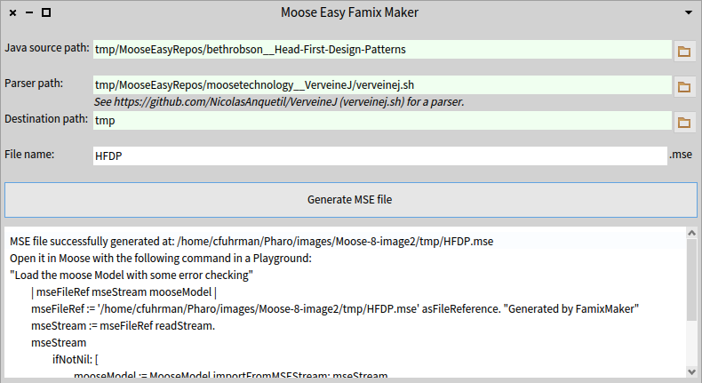
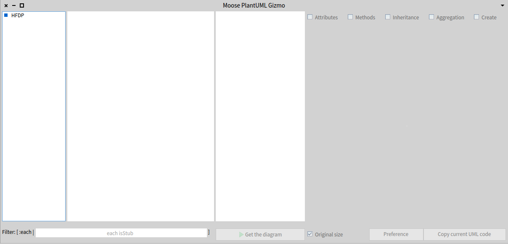
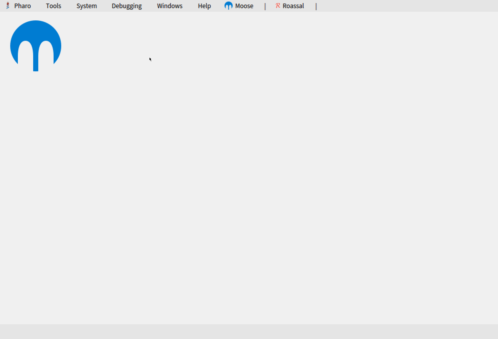

# Static Analysis of Java with Moose
Christopher FUHRMAN<br/>
Professor in Software and IT Engineering<br/>
École de technologie supérieure (ETS)

<span style="background-color:lightgreen">`tiny.cc/moose-tuto`</span> supporting [this blog entry](https://fuhrmanator.github.io/2019/07/29/AnalyzingJavaWithMoose.html).

---

# Technologies
 |
-------------|---------------
{class=plain}{style="height:100px;"} | {class=plain}{style="height:100px;"}
{class="plain"}{style="height:100px;"} | {class="plain"}{style="height:100px;"}

---

<!-- .slide: data-background-image="images/pharo.png" data-background-position="90% 10%" data-background-repeat="no-repeat" data-background-size="40% auto" data-background-opacity="0.8" -->

# Pharo

- Language (inspired by Smalltalk)
- Platform (immersive programming)
  - Image-based platform (like VirtualBox)
- Moose is a set of tools running in Pharo


---

## Overview


Example from my blog <br/>[Analyzing Java with Moose 8](https://fuhrmanator.github.io/2019/07/29/AnalyzingJavaWithMoose.html)

---

# Preliminaries

Install the following for this tutorial

- `java` (command in path) JRE v. 8+
- `git` (command in path)

---

# Preliminaries Pharo

- [Install and run the Pharo Launcher](http://pharo.org/download).
- Copy `Moose-8` image from the Inria CI:
  **New Image Templates \> Official distributions \> Moose Suite 8.0 (development version) \> Create image**
- Launch the image once it has downloaded.


---

## Cloning a project from GitHub


--

## Cloning a project from GitHub

Clone using 

```bash
git clone ...
```

-or-

Clone with `MooseEasyUtility`.
In a Moose Playground (<kbd>CTRL</kbd>+<kbd>O</kbd>+<kbd>W</kbd>):

```smalltalk
javaProjectFileRef := MooseEasyUtility cloneGitHubRepo:
    'https://github.com/bethrobson/Head-First-Design-Patterns'.
```

---

## Creating a Moose Model (FAMIX)


--

## Creating a Moose Model (FAMIX)

We will parse Java source to a Moose Model using [VerveineJ](https://github.com/moosetechnology/VerveineJ).

1. Install VerveineJ in a Moose Playground as follows:

```smalltalk
verveineJFileRef := MooseEasyUtility cloneGitHubRepo:
    'https://github.com/moosetechnology/VerveineJ'.
```

> You can also install it by cloning the repo in a command line.

--

## Creating a Moose Model (FAMIX)

2. Start the `FamixMaker` tool in the menu **Moose > Moose Tools > Famix Maker** to produce a `tmp/HFDP.mse` Moose Model



---

## Loading model in Moose


--

## Loading model in Moose

In a Moose Playground, execute:

```smalltalk
"Load the moose Model with some error checking"
| mseFileRef mseStream mooseModel |
mseFileRef := 'tmp/HFDP.mse' asFileReference. "Generated by FamixMaker"
mseStream := mseFileRef readStream.
mseStream
	ifNotNil: [ 
		mooseModel := MooseModel importFromMSEStream: mseStream. 
		mooseModel rootFolder:
      'tmp/MooseEasyRepos/bethrobson__Head-First-Design-Patterns'.
		mooseModel install. "So it appears in the Panel"
		mseStream close. ]
	ifNil: [ self error: 
    'Could not load MSE file into Moose: ' , mseFileRef asString ].
```

---

## Visualizing the model (PlantUML)


--

## Visualizing the model (PlantUML)

- Click **Moose \> Moose Projects \> Load PlantUML Gizmo** to load the project.
- Invoke the GUI with the following command in a Moose Playground:

  ```smalltalk
  PUGizmoForMoose open.
  ```

--

## Visualizing the model (PlantUML)

The following browser should appear:



--

## Visualizing the model (PlantUML)

See the [blog entry](https://fuhrmanator.github.io/2019/07/29/AnalyzingJavaWithMoose.html) for details.

---

## Analyzing the model


--

## Analyzing the model

There are some other ways to use Pharo to do analyses on a Java model. Benoît Verhaeghe has a [complementary blog entry](https://badetitou.github.io/misc/moose/pharo/2019/09/13/OOAnalysis/) to show such analyses.

Execute the following in a Moose Playground:

```smalltalk
Metacello new
    githubUser: 'badetitou' project: 'OOAnalysis' commitish: 'master' path: '.';
    baseline: 'OOAnalysis';
    load
```

--

## Analyzing the model

`<scripts >` in `OOAnalysis/OOCriticsVisu`:



--

## Analyzing the model

Write your own analyses in Pharo/Moose.

Learn more Pharo:
- [Pharo MOOC](http://mooc.pharo.org/)
- Pharo on [exercism.io](https://exercism.io/tracks/pharo-smalltalk)
- [Pharo By Example](https://books.pharo.org/updated-pharo-by-example/) book
- [MGL843 Sujets avancés en conception logicielle](https://sites.google.com/etsmtl.net/mgl843) (master's course at ÉTS)

--

## Analyzing the model

Write your own analyses in Pharo/Moose.

Learn more [Moose](https://moosetechnology.org/):
- [MooseQuery](https://moosequery.ferlicot.fr/devdocumentation.html) for advanced queries in Moose models
- [GitMiner](https://github.com/fuhrmanator/GitMiner) has a few classes to do static analysis

--

## Analyzing the model

Write your own analyses in Pharo/Moose.

Analyze other languages (experimental):
- C# - [roslyn2famix](https://github.com/feenkcom/roslyn2famix)
- C++ - [VerveineC-Cpp](https://github.com/jecisc/VerveineC-Cpp/) was started but not quite finished
- Fortran - [VerveineF](https://github.com/NicolasAnquetil/VerveineF)

---

# Feedback

Please leave me feedback at the bottom of the [blog entry](https://fuhrmanator.github.io/2019/07/29/AnalyzingJavaWithMoose.html), or via email: [Christopher.Fuhrman@etsmtl.ca](mailto:Christopher.Fuhrman@etsmtl.ca)